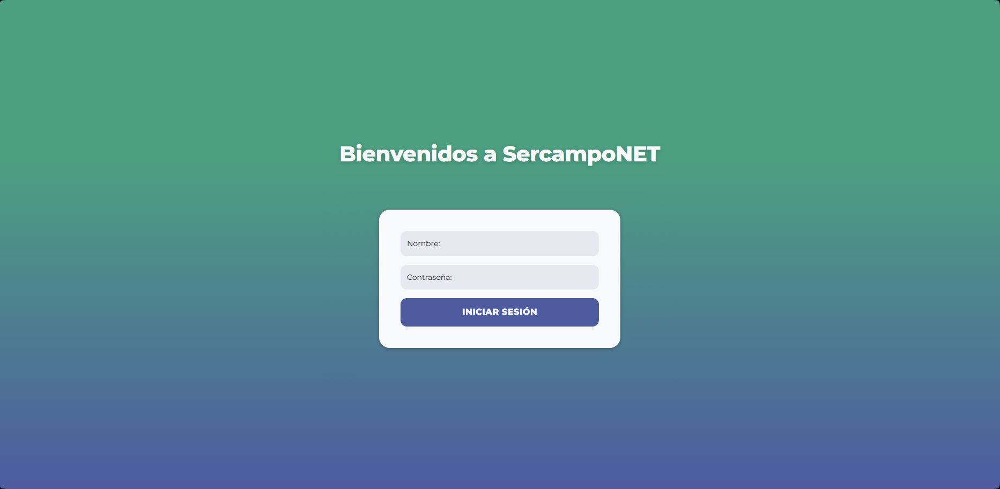
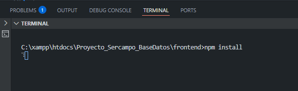
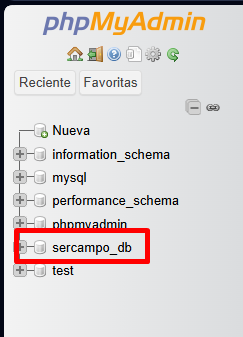

# Proyecto SERCAMPONET

El proyecto tiene como finalidad el desarrollo de una aplicación web dinámica orientada a la gestión integral de una empresa dedicada a la recogida y reciclaje de aceite, mediante contenedores distribuidos en diferentes ubicaciones geográficas. La solución propuesta, integra tecnologías tanto del lado del cliente como del servidor, así como el diseño y explotación de una base de datos relacional.

La aplicación permitirá centralizar la información relativa a clientes, contenedores, rutas de recogida, conductores, productos entregados y registros de actividad, proporcionando una herramienta que facilite la toma de decisiones, la trazabilidad de las operaciones y la optimización de los recursos logísticos.
El sistema está diseñado bajo un enfoque modular y escalable, permitiendo la incorporación de nuevas funcionalidades en fases posteriores, como la geolocalización avanzada o sistemas de alertas automatizadas.
Este proyecto surge por la necesidad en la empresa Sercampo, de una hacer digitalización adecuada y funcional del proceso de recogida de datos e información actualmente obsoleta.

Tras una breve presentación de su problema y entrevistarnos con los responsables de la empresa y la persona encargada de dicho registro de información, se desarrolló la aplicación.

## Comenzando 🚀

_Estas instrucciones te permitirán obtener una copia del proyecto en funcionamiento en tu máquina local para propósitos de desarrollo y pruebas._

- Descargar el proyecto

- Guardar carpeta en tus archivos locales
- Abrir la carpeta en VSCode
- Ejecutar el comando ´npm install´ para instalar las dependencias y Angular/CLI

- En phpMyadmin crear una nueva base de datos llamada "sercampo_db"

- Abrir el archivo init.sql y ejecutarlo para instalar la base de datos.
- Para ver el proyecto iniciado en el navegador hacer en la consola: ng serve -o
   

## Construido con 🛠️

* [Angular](https://angular.dev) - El framework web usado
* [Bootstrap](https://getbootstrap.com/docs/5.0/getting-started/introduction/) - Estilos
* [MySQL](https://www.mysql.com) - Sistema Gestor de Base de Datos
* [PHP](https://www.php.net/manual/en/index.php) - Lenguaje utilizado para el Backend de la aplicación

## Documentación 📖

Puedes encontrar mucha más de información este proyecto en nuestra [Documentación](https://github.com/AsierMartinez2000/Proyecto_Sercampo_BaseDatos/tree/develop/Anexos)
Aquí puedes acceder a la memoria [Memoria](https://github.com/AsierMartinez2000/Proyecto_Sercampo_BaseDatos/blob/develop/Anexos/Memoria/Memoria_Final_SercampoNET_AsierMartinez_LauraOlmedilla.pdf)
Aquí puedes acceder al Manual de Usuario [ManualUsuario](https://github.com/AsierMartinez2000/Proyecto_Sercampo_BaseDatos/blob/develop/Anexos/Manual%20de%20Usuario/Manual%20de%20Usuario%20-%20SercampoNET.pdf)

## Autores ✒️

* **Asier Martínez**  - [AsierMartinez2000](https://github.com/AsierMartinez2000)
* **Laura Olmedilla** - [olmelau](https://github.com/olmelau)
